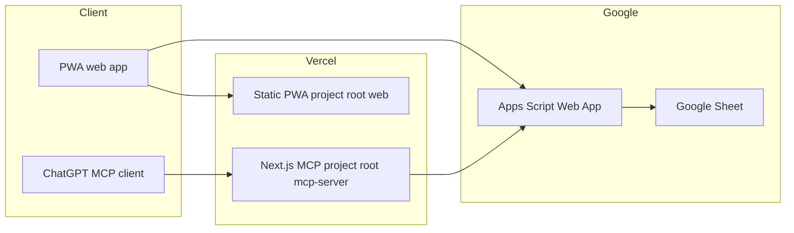

# Execution OS 2.0 — Project documentation

End-to-end guide for the **PWA**, **Google Apps Script / Sheets** backend, and optional **remote MCP server** (Vercel).  
Google Sign-In is deferred; the shared secret gates API access until OAuth is added.

**Related files (repo paths):**

| Document | Role |
|----------|------|
| This file | Single canonical overview and operations guide |
| [project_plan.txt](project_plan.txt) | Original product spec (fields, goals) |
| [google-apps-script/MCP_LOGS_API.md](../google-apps-script/MCP_LOGS_API.md) | `get_logs` API detail (kept in-repo for Apps Script–focused edits) |
| [mcp-server/README.md](../mcp-server/README.md) | MCP server quick reference + link here |

---

## Table of contents

1. [System overview](#1-system-overview)
2. [Repository layout](#2-repository-layout)
3. [PWA (`web/`)](#3-pwa-web)
4. [Google Sheets + Apps Script](#4-google-sheets--apps-script)
5. [HTTP APIs](#5-http-apis)
6. [`get_logs` — machine-readable logs (MCP / tooling)](#6-get_logs--machine-readable-logs-mcp--tooling)
7. [MCP server (`mcp-server/`)](#7-mcp-server-mcp-server)
8. [Product rules (app behavior)](#8-product-rules-app-behavior)
9. [Security and future auth](#9-security-and-future-auth)
10. [Troubleshooting](#10-troubleshooting)

---

## 1. System overview



- **PWA**: React (Vite) + IndexedDB offline; optional sync to Apps Script. Deploy as **one Vercel project** with root directory **`web/`**.
- **Backend**: Apps Script exposes a **Web app URL** (`…/exec`); the sheet stays in your Google account. **Anyone** can hit the URL; **`EXECUTION_OS_SECRET`** (query/body) is the gate.
- **MCP (optional)**: Separate **Next.js** app; **ChatGPT** calls **`https://<mcp-host>/api/mcp`**. The server adds **`APPS_SCRIPT_TOKEN`** server-side when calling `get_logs`. Use a **second Vercel project** with root **`mcp-server/`** — not the same project as the PWA.

---

## 2. Repository layout

| Path | Purpose |
|------|---------|
| [`web/`](../web/) | React (Vite) + TypeScript + Tailwind + Zustand + React Router 6 |
| [`google-apps-script/`](../google-apps-script/) | [`Code.gs`](../google-apps-script/Code.gs) — REST layer, sheet bootstrap, `get_logs` |
| [`mcp-server/`](../mcp-server/) | Optional remote MCP (Next.js + `mcp-handler`) — tool **`fetch_logs`** → Apps Script |
| [`project_plan.txt`](project_plan.txt) | Detailed product / field spec |
| [`docs/PROJECT_DOCUMENTATION.md`](PROJECT_DOCUMENTATION.md) | This document |

---

## 3. PWA (`web/`)

### Stack

- React 19, Vite, TypeScript, Tailwind, Zustand, React Router 6, IndexedDB (offline log storage).

### Local development

```bash
cd web
cp .env.example .env
# Leave URL/secret empty for offline-only, or set after Apps Script deploy.
npm install
npm run dev
```

Env template: [`web/.env.example`](../web/.env.example).

| Variable | Use |
|----------|-----|
| `VITE_APPS_SCRIPT_URL` | Web app URL ending in `/exec` (no query string) |
| `VITE_SCRIPT_SECRET` | Same value as Script property **`EXECUTION_OS_SECRET`** |

### Production build & PWA

```bash
cd web
npm run build
npm run preview
```

Use **HTTPS** (e.g. Vercel) so install prompts and the service worker work reliably.

### Deploy on Vercel (PWA project)

- **Root directory:** `web`
- **Framework:** Vite
- **Environment variables:** `VITE_APPS_SCRIPT_URL`, `VITE_SCRIPT_SECRET`
- [`web/vercel.json`](../web/vercel.json) rewrites all paths to `index.html` for client-side routing.

**Important:** The PWA project does **not** serve `/api/mcp` or MCP routes. Those live only on the **`mcp-server`** project.

---

## 4. Google Sheets + Apps Script

### One-time setup

1. Create a **Google Sheet** you own.
2. **Extensions → Apps Script** → paste [`google-apps-script/Code.gs`](../google-apps-script/Code.gs) (set timezone in Project Settings if you change `appsscript.json`).
3. **Project Settings → Script properties**
   - **`SPREADSHEET_ID`** — from the sheet URL (`/d/THIS_PART/edit`)
   - **`EXECUTION_OS_SECRET`** — long random string (same as `VITE_SCRIPT_SECRET` / `APPS_SCRIPT_TOKEN`)
4. Run **`setupExecutionOsSheets`** once from the editor (Run → authorize). Creates **Logs**, **Reference**, **Analytics** and headers.
5. **Deploy → New deployment → Web app**
   - Execute as: **Me**
   - Who has access: **Anyone** (secret is the gate; sheet remains private to your Google account)

Copy the **Web app URL** (`…/exec`) into the PWA and MCP env vars.

### CORS note

The web client may send **`POST upsertLog`** as **`Content-Type: text/plain`** with a JSON body to reduce CORS preflight issues. If the browser still blocks `script.google.com`, use a small proxy or test from an environment with relaxed policies.

### Existing sheet migration (schema updates)

If you already have a **Logs** tab from an older template:

- **Removed columns:** `focus_score`, `discipline_score` — safe to delete those columns from row 1 when convenient; new app versions no longer read or write them.
- **Renamed column:** `packaged_foods_notes` → **`packaged_and_outside_foods_notes`**. Rename the header in row 1 (or add the new column and copy data). Until you rename, the app still **reads** the old header and **writes** via `upsertLog` into whichever column your sheet uses (see `objectToRow_` alias in [`Code.gs`](../google-apps-script/Code.gs)).

New installs from **`setupExecutionOsSheets`** get the current [`LOG_HEADERS`](../google-apps-script/Code.gs) only.

---

## 5. HTTP APIs

All query/body secrets align with **`EXECUTION_OS_SECRET`** (PWA uses `secret` on legacy actions; `get_logs` accepts **`token`** or **`secret`**).

| Action | Method | Summary |
|--------|--------|---------|
| `getLog` | `GET` | `?action=getLog&date=YYYY-MM-DD&secret=...` — single day |
| `getRecentLogs` | `GET` | `?action=getRecentLogs&secret=...` — last **14** calendar days (script timezone) |
| `get_logs` | `GET` | `?action=get_logs&start=YYYY-MM-DD&end=YYYY-MM-DD&token=...` — normalized JSON for MCP/tooling ([§6](#6-get_logs--machine-readable-logs-mcp--tooling)) |
| `upsertLog` | `POST` | Body JSON: `{ "action": "upsertLog", "secret": "...", "log": { ... } }` |

---

## 6. `get_logs` — machine-readable logs (MCP / tooling)

This section matches [`google-apps-script/MCP_LOGS_API.md`](../google-apps-script/MCP_LOGS_API.md) (edit there if you change script behavior only).

### Assumptions

- **Sheet tab:** `MCP_LOG_SHEET_NAME` in `Code.gs` (default **`Logs`**). Row 1 = headers; one row per calendar day; avoid merged data cells.
- **Schema:** Follows **`LOG_HEADERS`** in [`Code.gs`](../google-apps-script/Code.gs). The API returns columns that exist in row 1.
- **Auth:** `EXECUTION_OS_SECRET` via **`token`** or **`secret`** query param.
- **Timezone:** **Asia/Kolkata (IST)** for date handling and timestamp normalization, consistent with the rest of the script.

### Normalization rules

| Rule | Behavior |
|------|----------|
| **Blanks** | `''`, `null`, `undefined` → JSON `null` |
| **Booleans** | `workout_done`, `warmup_done`, `meditation_done`: `TRUE`/`FALSE`, `1`/`0`, `YES`/`NO` → boolean; else `null` |
| **Numbers** | Listed numeric columns: finite number after parsing (commas stripped); invalid → `null` |
| **Timestamps** | `wake_time`, `reach_office_time`, `leave_office_time`, `sleep_time`, `last_updated_at`: prefer ISO `yyyy-MM-dd'T'HH:mm:ss+05:30` when parseable; else trimmed string |
| **`date`** | Must be valid `YYYY-MM-DD` to be included in `logs` |
| **`workout_log_json`** | Valid JSON → parsed object/array; invalid → raw string + `workout_log_json_invalid: true`; empty → `null` |
| **Other text** | String after empty check |

**Rows**

- **Skipped** (`skipped_rows++`): `date` missing, empty, or invalid `YYYY-MM-DD`.
- **Omitted** (not error): valid `date` outside inclusive `[start, end]`.
- **Partially invalid fields:** Row still returned; bad fields become `null` / best-effort types.

**Implementation** (in `Code.gs`): `handleGetLogsMcp_`, `normalizeLogObjectForMcp_`, `MCP_LOG_SHEET_NAME`.

### Example requests

```text
YOUR_DEPLOY_URL?action=get_logs&start=2026-03-30&end=2026-04-02&token=YOUR_SECRET
YOUR_DEPLOY_URL?action=get_logs&start=2026-03-30&end=2026-04-02&secret=YOUR_SECRET
```

### Example success payload

```json
{
  "success": true,
  "source": "daily_log_sheet",
  "action": "get_logs",
  "start": "2026-03-30",
  "end": "2026-04-02",
  "count": 2,
  "skipped_rows": 0,
  "logs": [ { "date": "2026-03-30", "wake_time": "2026-03-30T07:15:00+05:30" } ]
}
```

Real responses include **every** header column. See [`MCP_LOGS_API.md`](../google-apps-script/MCP_LOGS_API.md) for error JSON examples and future ideas (`get_recent_logs`).

---

## 7. MCP server (`mcp-server/`)

### Role

**Read-only** MCP over **Streamable HTTP**: ChatGPT → **`/api/mcp`** → server adds token → Apps Script **`get_logs`**.

Stack: **Next.js 15**, **`mcp-handler`**, **`@modelcontextprotocol/sdk`**. SSE disabled (`disableSse: true`). Node **18+**.

### Important: two Vercel projects

| Vercel project | Root directory | Purpose |
|----------------|----------------|---------|
| PWA | `web` | Static SPA + rewrites to `index.html` |
| MCP | `mcp-server` | Next.js API routes |

Production hostname **`execution-os-2.vercel.app`** (or similar) attached to **`web`** will **not** expose `/api/mcp`. Use the MCP project’s hostname for ChatGPT.

### Project structure (code)

| Path | Role |
|------|------|
| [`app/api/mcp/route.ts`](../mcp-server/app/api/mcp/route.ts) | MCP Streamable HTTP — **`/api/mcp`** |
| [`pages/api/verify-deployment.ts`](../mcp-server/pages/api/verify-deployment.ts) | Temp ops: **`GET /api/verify-deployment`** (JSON ping) |
| [`pages/api/sheet-logs.ts`](../mcp-server/pages/api/sheet-logs.ts) | Temp ops: **`GET /api/sheet-logs`** — browser-friendly `get_logs` passthrough |
| [`src/lib/register-tools.ts`](../mcp-server/src/lib/register-tools.ts) | Registers **`fetch_logs`** |
| [`src/lib/apps-script.ts`](../mcp-server/src/lib/apps-script.ts) | HTTP client for Apps Script |
| [`src/lib/env.ts`](../mcp-server/src/lib/env.ts) | Validates env |
| [`vercel.json`](../mcp-server/vercel.json) | Framework preset (`maxDuration` via `export const maxDuration = 60` in routes) |

### Environment variables

Template: [`mcp-server/.env.example`](../mcp-server/.env.example).

| Variable | Description |
|----------|-------------|
| `APPS_SCRIPT_BASE_URL` | Full web app URL ending in `/exec` (no query string) |
| `APPS_SCRIPT_TOKEN` | Same as **`EXECUTION_OS_SECRET`** (sent as `token` to Apps Script) |
| `VERBOSE_MCP_LOGS` | Optional: `1` for verbose `mcp-handler` logs |

### Deploy on Vercel (MCP project)

1. Import repo → **Root Directory** **`mcp-server`**
2. Framework: Next.js
3. Set **`APPS_SCRIPT_BASE_URL`** and **`APPS_SCRIPT_TOKEN`** (Production; Preview if needed)
4. Deploy

### Deployment protection and ChatGPT

If **Vercel Authentication / Deployment Protection** is on, ChatGPT receives HTML (“Authentication Required”) instead of MCP JSON — the connector fails.

- **Disable** protection for the MCP project (at least Production), **or** ensure the URL you give ChatGPT is a **public** production deployment.

ChatGPT **MCP URL** (no path beyond this):

```text
https://<mcp-project-host>/api/mcp
```

**Do not** put `fetch_logs` in the URL; that is a **tool** invoked after connect.

**GET** `/api/mcp` in a browser returns a JSON-RPC **Method not allowed** — expected; clients use **POST**.

### Tool: `fetch_logs`

| Input | Rule |
|-------|------|
| `start_date` | `YYYY-MM-DD`, required |
| `end_date` | `YYYY-MM-DD`, required, `start_date <= end_date` |

Calls Apps Script with `action=get_logs`. Normalization is done in **Apps Script** ([§6](#6-get_logs--machine-readable-logs-mcp--tooling)).

### Temporary ops routes

- **`GET /api/verify-deployment`** — confirms routing (no secrets).
- **`GET /api/sheet-logs?start=&end=`** — same data as `get_logs` for browser testing. Remove before hardening if desired.

### Local MCP development

```bash
cd mcp-server
cp .env.example .env.local
# set APPS_SCRIPT_BASE_URL and APPS_SCRIPT_TOKEN
npm install
npm run dev
```

MCP: `http://localhost:3000/api/mcp`

### Future extensions

Ideas (not implemented): `fetch_recent_logs(days)`, `fetch_week_summary` — add tools in [`register-tools.ts`](../mcp-server/src/lib/register-tools.ts) reusing [`fetchLogsFromAppsScript`](../mcp-server/src/lib/apps-script.ts).

---

## 8. Product rules (app behavior)

- **Sleep hours:** Previous calendar evening’s **`sleep_time`** and this day’s **`wake_time`** (ISO timestamps) derive sleep duration. If yesterday has no sleep, hours stay blank until data exists.
- **Work completion % (History):** `(Done=1, Partial=0.5, Not Done=0)` averaged across the three priorities × 100.
- **Focus work (UI):** Entered in **hours** in half-hour steps; stored as **`focus_work_minutes`** (multiples of 30) in the sheet.

Full field list and goals: [`project_plan.txt`](project_plan.txt).

---

## 9. Security and future auth

- Today: **shared secret** on Apps Script; MCP server stores token only in **Vercel env** (not returned to clients).
- **Roadmap:** Replace or supplement with **Google Sign-In** and token checks in `Code.gs`; optional **Bearer** auth on MCP via `mcp-handler` when needed.

---

## 10. Troubleshooting

| Symptom | Check |
|---------|--------|
| ChatGPT MCP HTML / “Authentication Required” | Turn off **Deployment Protection** on the **MCP** Vercel project; use MCP project URL, not PWA URL |
| `/api/mcp` works but `/api/sheet-logs` 404 | Redeploy latest `main`; confirm root **`mcp-server`** |
| PWA shows at `…/api/…` | You are on the **web** project — SPA rewrite serves `index.html`; use **MCP** host for APIs |
| `fetch_logs` / `get_logs` errors | `APPS_SCRIPT_*` on Vercel; Apps Script **deployed**; `get_logs` works in browser with `token` |
| CORS / preflight to Apps Script | `POST` as `text/plain` body; or proxy |

---

*Last consolidated from root README, `mcp-server/README`, and `MCP_LOGS_API.md`. Prefer updating the linked source files for deep detail, then sync any overview changes here.*
